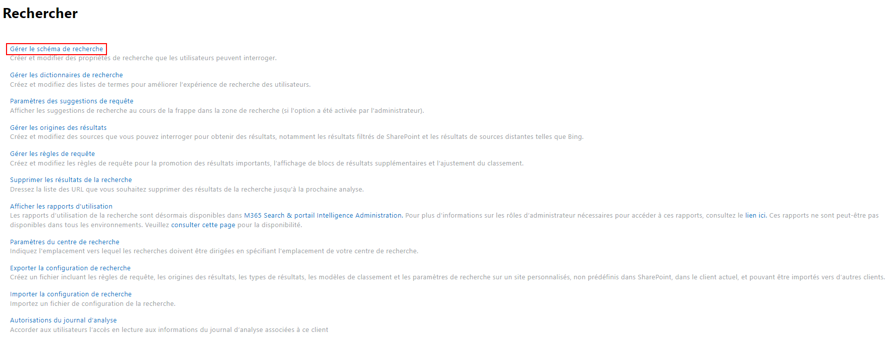

# Guide pas-à-pas pour ajouter une nouvelle propriété personnalisée dans le Profil Utilisateur SharePoint Online

Dans SharePoint Online, le Profil Utilisateur joue un rôle clé pour stocker et gérer les informations relatives aux utilisateurs.
Bien que SharePoint Online offre un ensemble de propriétés prédéfinies, il est parfois nécessaire d'ajouter des propriétés personnalisées pour répondre aux besoins spécifiques de votre organisation
Dans cet article, nous allons vous guider à travers les étapes pour ajouter une nouvelle propriété personnalisée dans le Profil Utilisateur de SharePoint Online.

Dans le cadre de cet article, nous allons créer une nouvelle propriété utilisateur **Trigramme** qui est une chaine de 3 caractères reprenant les initiales de l'utilisateur.

## Accéder au Centre d'administration SharePoint Online

Pour commencer, connectez-vous au **Centre d'administration SharePoint Online** à l'aide d'un compte disposant des droits d'administration.
L'URL du Centre d'administration SharePoint Online est **https://{tenant}-admin.sharepoint.com** en remplaçant {tenant} par le nom de votre tenant.

## Accéder aux Paramètres du Profil Utilisateur

Dans le Centre d'administration SharePoint Online, cliquez sur **Plus de fonctionnalités** dans le menu de gauche, puis sélectionnez **Profils utilisateur**.

## Créer une nouvelle propriété personnalisée

Dans la page **Profils utilisateur**, cliquez sur **Gérer les propriétés utilisateur** pour afficher la liste des propriétés existantes.

## Remplir les détails de la propriété

Dans le formulaire de création, remplissez les informations suivantes :

- **Nom** : Entrez un nom significatif pour votre propriété personnalisée.
- **Type de données** : Sélectionnez le type de données approprié pour votre propriété (texte, nombre, date/heure, etc.)
- **Longueur maximale** : Définissez la longueur maximale de la valeur de propriété.

Dans le cadre de cet article, nous créons une nouvelle propriété utilisateur **Trigramme** qui est une chaine de 3 caractères reprenant les initiales de l'utilisateur.

Dans les **Paramètres de recherche**, pensez à cocher la case **Indexé** si vous souhaitez que cette propriété apparaisse dans les résultats de recherche.

A noter que la synchronisation des données avec les propriétés Azure Active Directory n'est pas possible ici et il faudra donc le faire après coup via un script PowerShell.

## Enregistrer la propriété

Une fois que vous avez rempli tous les détails de la propriété, cliquez sur le bouton **OK** pour l'enregistrer.

Vous êtes alors redirigé vers la liste de l'ensemble des propriétés des **Profils utilisateur** où vous pouvez voir votre propriété nouvellement créée.

## Synchroniser les propriétés

Après avoir ajouté une nouvelle propriété personnalisée, vous devez vous assurer que les profils utilisateurs sont synchronisés avec Active Directory.
Comme mentionné précédemment, la synchronisation avec Azure Active Directory doit être réalisée via un script PowerShell.
Plus d'informations disponibles sur cette partie ici : https://learn.microsoft.com/en-us/sharepoint/user-profile-sync
Cette étape spécifique fera l'objet d'un prochain article.

Pour vous assurer que vos profils ont été correctement mis à jour suite à la synchronisation, il suffit d'aller voir les profils utilisateurs en cliquant sur **Gérer les profils utiliteur** depuis la page d'accueil des **Profils utilisateur**, de rechercher un profil puis de l'éditer en cliquant sur **Modifier mon profil** :

Dans le profil utilisateur sélectionné, votre nouvelle propriété doit être visible et valorisée grâce à la synchronisation précédente.

Ici, la propriété **Trigramme** de Adele Vance a été correctement valorisée avec ses initiales :

## Configurer l'indexation de la propriété personnalisée

Dès lors qu'au moins un profil possède une valeur pour cette nouvelle propriété, SharePoint va automatiquement ajouter une propriété analysée au schéma de recherche du tenant correspondant à votre nouvelle propriété utilisateur.
Attention, cette opération peut aller jusqu'à plusieurs heures d'attente, le temps que SharePoint détecte cette nouvelle metadonnée et l'ajoute dans le schéma de recherche.

Pour accéder au schéma de recherche, depuis la page d'accueil d'accueil du Centre d'administration SharePoint Online, cliquez sur **Plus de fonctionnalités** dans le menu de gauche, puis sélectionnez sur le bouton **Ouvrir** de la section **Rechercher**.

Puis cliquer sur **Gérer le schéma de recherche** :

Pour trouver la propriété analysée correspondant à votre propriété créée depuis le **Profil utilisateur**, cliquer sur l'onglet **Propriétés analysées** puis remplissez les champs de formulaire de recherche.

Exemple ci-dessous avec la propriété analysée **People:Trigramme** qui a été créée à partir de la propriété utilisateur **Trigramme** dans la configuration de la recherche du tenant :

Si votre propriété est bien présente ici, alors ça veut dire que sa valeur peut être correctement remontée dans les résultats de recherche.

A noter que dans le schéma de recherche, la propriété personnalisée sera préfixée par **People:** afin de bien distinguer le fait que c'est une propriété issue du **Profil utilisateur**.
Ce préfix correspond à la catégorie de la propriété analysée.
Veuillez également noter que la propriété n'est, à ce stade, pas encore mappé à une propriété gérée.
Cette étape sera détaillée dans un prochain article.

## Conclusion

En suivant les étapes décrites ci-dessus, vous pouvez facilement ajouter une propriété personnalisée au Profil Utilisateur de SharePoint Online et la configurer pour qu'elle remonte dans les résultats de recherche.
Cette fonctionnalité offre une meilleure recherche et une utilisation plus efficace des informations utilisateur dans votre environnement SharePoint Online.
N'oubliez pas de synchroniser les profils utilisateurs avec Azure Active Directory et de configurer l'indexation appropriée pour que la propriété personnalisée soit pleinement fonctionnelle.
Profitez de cette personnalisation pour améliorer la pertinence des résultats de recherche dans votre organisation.
